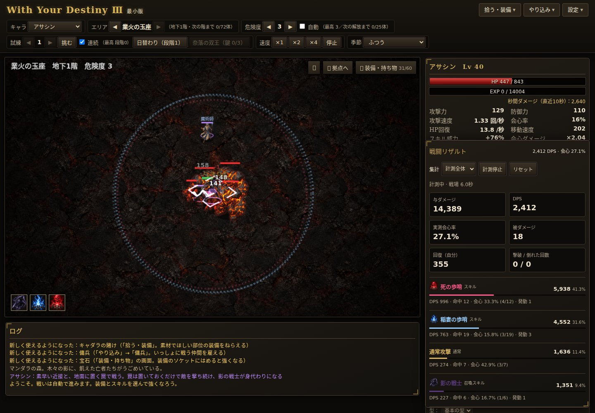
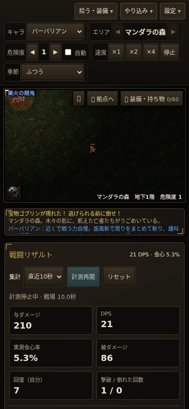

# 戦闘リザルト・演出の追加（Codex）

対象：`claude/elegant-planck-znul52-skillfx`（`fec4830`）。前回PR #98の表示改善も含む。

## 追加したもの
- PC右下の折りたたみリザルト。スマホは戦闘画面の下。「計測全体／直近10秒」「計測停止・再開」「リセット」。
- 通常攻撃・各スキル・罠・召喚・傭兵・装備効果・祠のダメージ、構成比、DPS、命中数、実測会心率、発動数。自分の被ダメージ・回復、撃破・倒れた回数も表示。
- 防御・強化・束縛・召喚・罠・オーラ・地面の呪文に固有の形と動き。罠の炎・稲妻・影を区別。疫病の霧・天の裁きは炎の爆発の代わりに適切な既存画像を使う。新しい画像素材は追加せずCanvas描画で補強。

## 集計の定義
- 与ダメージは敵HPを超えた分・無効化を除いた実際のダメージ。従来のキャラ欄DPSはHP超過分込みなので、値が異なる場合がある。
- 会心率＝会心回数÷会心判定のある命中数。反射・雷鳴などは分母に入れない。攻撃力アップなどの補助効果は、強化された元の攻撃へ含める。
- DPSの時間はゲーム内の戦場時間（復活待ち・移動を含む）。拠点・停止中・オフラインは除外。直近は直近10秒の戦場時間。
- 回復は自分のHPが実際に戻った量。復活・拠点での全快は含めない。召喚や傭兵自身の被ダメージ・回復は含めない。
- 記録はworld内のみ。リセット・ページ再読み込み・職業変更で消える。戦闘数値・装備性能・セーブ形式は変更していない。

## 確認結果
| 確認 | 結果 |
|---|---|
| `node tools/combat-results-test.js` | 11検証成功。HP超過・無効化・会心分母・回復・停止・拠点・期間・リセット・持続・二次爆発・イベント記録の整理 |
| `node tools/combo-test.js` | 6職業すべてok、errors 0 |
| `node tools/fuzz-test.js barbarian 2000` | errors 0、NaNなし、再読み込み成功 |
| `node tools/fuzz-test.js sorceress 2000` | 同上 |
| `node tools/fuzz-test.js necromancer 2000` | 同上 |
| `node tools/fuzz-test.js paladin 2000` | 同上 |
| `node tools/fuzz-test.js assassin 2000` | 同上 |
| `node tools/fuzz-test.js druid 2000` | 同上 |
| 6職業の集計・描画確認 | 各発生源の合計＝全体ダメージ。会心回数≦判定回数。JavaScriptエラー0 |
| 新描画の全9種類＋罠の3種類 | 複数の経過時点で描画成功。描画中の乱数消費なし |
| 同一乱数の300秒比較（演出を無効化） | 6職業ともHP・位置・敵・味方・装備・経験値・素材・次の乱数が前回版と一致。撃破数は順に304／306／300／302／309／302。バランス評価用の測定ではない |
| 旧セーブ | Lv25、EXP345、素材789、持ち物が一致。集計がセーブへ入らないことを確認 |
| 390×844／844×390のタッチ模擬 | 横にはみ出さず、展開・期間切替・停止・リセットが動く |

Chromium 153＋Playwright。画像を読み込んだアサシン、3スキル、傭兵、敵6体、4倍速、リザルト展開状態で110フレーム：間隔中央値16.7ms、95%点16.8ms、最大33.3ms。クラウドPCでの参考値で、実機スマホは未確認。

## 表示・演出の数値
- `data/results.js`：`recentSeconds` 未設定→10、`refreshMs` 未設定→400、`compactAfter` 未設定→256。集計表示と記録整理のための値。
- `data/vfx.js`：`signature` を追加（継続0.65秒、基本半径62、線幅3.5、放射8本）。`trapShot` を追加（継続0.28秒）。`auraMarks` を追加（6個）。いずれも表示だけ。
- 新規紋章・罠の射撃は既存の `maxEffects: 140` を使用。戦闘のダメージ・範囲・クールダウンは変更していない。

## 確認画像
敵HP・装備を用意した確認用画面。紋章・射撃の形が分かるよう、演出を特定の時点で表示したもの。ゲーム内の通常の育成結果ではない。

試し用：https://raw.githack.com/0909244a0000-coder/with-your-destiny-3/codex/combat-results-fx-2026-10-04/index.html
