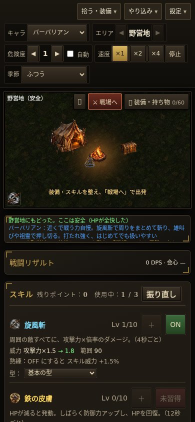

# エフェクト描き直し・拠点開始（2026-10-04、Codex）

PR #100への追記。前回の幾何学的な線画が絵から浮くというユーザーの指摘を受けて変更。

## 変更
- 星・多角形・放射線・オーラの菱形を撤去。新しい煙4枚を追加。召喚は緑の煙、強化は赤い炎煙、防御・回復は金色の光、影は紫の残像。発動は一枚だけ拡大・上昇・減衰させ、継続オーラは薄く表示。
- 罠の射撃は画像の炎・稲妻・影。設置時の煙は装置の位置。大きな射程の点線円は発射中だけ薄く表示。旋風・氷・地面の既存画像は保持。
- 初回・再読み込み・職業変更後は野営地から開始。オフライン報酬は従来どおり受け取り、保存したエリア・階を出発先として保持。「戦場へ」で出発する。
- 上のエリア表示も野営地へ。拠点の案内と初回説明を更新。拠点の文字は `data/map.js` の既存HUD設定を使い、画面上で最低11px。
- 戦闘リザルトの機能は保持。攻撃・クールダウン・装備性能・セーブ形式の変更なし。

## 確認
| 条件・コマンド | 結果 |
|---|---|
| `node tools/start-town-test.js` | 新規・旧セーブ再開は拠点、全快・敵なし・集計時間0、野営地表示、保存したエリア／階／素材を保持、戦場へボタンで出発。エラー0 |
| `node tools/combat-results-test.js` | 11検証成功 |
| `node tools/combo-test.js` | 明示的に拠点を出てから測定。6職業すべてok、errors 0 |
| `node tools/fuzz-test.js <職業> 1500` | barbarian／sorceress／necromancer／paladin／assassin／druidで各1回、すべてerrors 0、NaNなし、再読み込み成功 |
| `node tools/balance-sim.js 1 barbarian` | 拠点を出て測定、Lv8、倒れ0、ERRORS []。進行することの確認で、バランス評価ではない |
| 旧版のセーブを読み込み | Lv25・EXP345・素材789・持ち物一致、リザルトを保存しない |
| 6職業の描画・リザルト | 各発生源の合計＝全体ダメージ、会心回数≦判定回数、描画中の乱数消費なし、JavaScriptエラー0 |
| 390×844／844×390、Chromium＋Playwright | 横はみ出しなし、リザルト展開・期間変更・停止・リセットのタッチ模擬成功 |

画像読込済みアサシン・敵6体・傭兵・3スキル・4倍速・リザルト展開で110フレーム：間隔中央値16.7ms、95%点33.3ms、最大33.4ms。クラウドPCの参考値。実機スマホは未確認。

## 表示設定と素材
- `data/vfx.js`：`signature`／`auraMarks` を削除し `castProfiles`／`castOverrides` を追加。発動0.55〜0.85秒、幅94〜132、濃さ0.55〜0.75。継続煙の濃さ0.14±0.05。表示だけの設定。
- `data/vfx.js` の `trapRangeAlpha`：従来の描画固定値0.25→0.05、発射中のみ。罠の射撃は継続0.28秒を保持。追加発動と射撃は既存 `maxEffects: 140` で制限。
- `assets/vfx/graveWisp.png`、`rageWisp.png`、`holyWisp.png`、`shadowWisp.png`。組み込み画像生成ツールを使用し、2×2シートを `tools/prepare_sprite.py --grid 2x2 --names graveWisp,rageWisp,holyWisp,shadowWisp --size 256` で切り出し。4枚合計約372KiB。

生成指示：
> Use case: stylized-concept. Asset type: one dark-fantasy ARPG spell VFX sprite atlas, square image, exactly 2 columns by 2 rows equally sized. Pure black background throughout, no grid lines, no text. Each quadrant contains a separate centered top-down organic volumetric wisp effect surrounded by generous black padding, does not cross cell borders. Top left: irregular low rolling necromantic green smoke with wispy frayed edges and a few tiny green motes, empty subdued center, NO skull. Top right: rising blood-red and warm amber smoke with sparse glowing ember flecks, savage berserker energy, irregular silhouette. Bottom left: pale antique-gold spectral vapor and soft silky luminous streams, holy protective energy, subdued center. Bottom right: deep violet shadow vapor drawn into a flowing crescent, ragged feathered smoky edges, a few violet motes. Mature western gothic dark fantasy game texture, high quality painted realistic smoke, restrained luminous detail. Avoid: circular outlines, polygons, runes, symbols, geometric patterns, stars, beams, weapons, characters, floor, scenery, icons, frames, UI, white overexposed center. These are textured wisps of smoke, NOT blast explosions. All 4 effects same apparent size filling middle 65% of quadrant.

## 確認画像
戦闘画像はLv40・敵HP増量・演出の経過時点を固定した描画確認用。通常の育成結果ではない。

試し用：https://raw.githack.com/0909244a0000-coder/with-your-destiny-3/codex/combat-results-fx-2026-10-04/index.html
