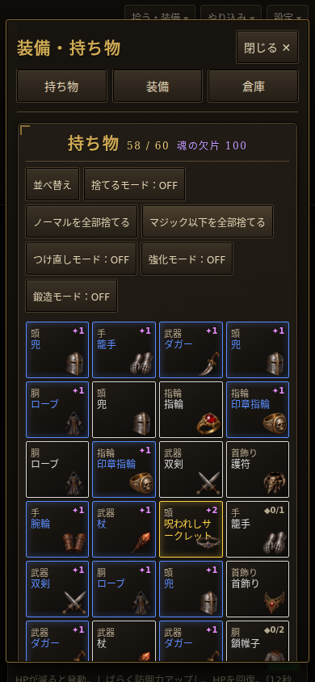
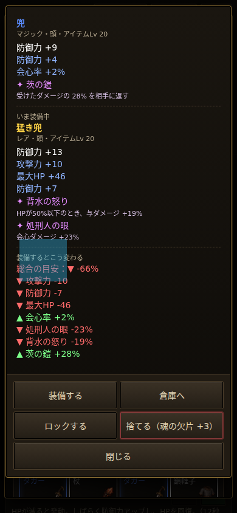

# 表示・スマホ操作の改善（Codex、2026-10-04）

対象：`claude/elegant-planck-znul52-skillfx`、元コミット `fec4830`。既存の石・鉄・金の見た目を保ち、読みやすさと操作導線を改善した。戦闘・装備・経験値の数値は変更していない。

## 変更と根拠（重要順）
1. **名前を読める大きさに。** 390px幅では従来の12pxが約4.6pxまで縮小されていた。精鋭・ドロップ名を画面上で最低11pxにし、火花より手前に描画。端からはみ出す長い名前は省略する。
2. **持ち物の整理へすぐ移動。** スマホでは持ち物を先頭へ、整理ボタンを一覧の上へ。「持ち物／装備／倉庫」と閉じるボタンを固定。60枠をスクロールしたあとでも移動・終了できる。
3. **比較中の操作ボタンを固定。** 効果が多い装備は説明が長く、従来は操作までスクロールが必要。説明だけをスクロールする形にし、装備・ロック・倉庫・閉じるを常に表示。
4. **スマホのスキルを先に表示。** 縦画面でステータス・装備効果より前へ移動。上のバーとスキルのボタンを大きくし、説明文・パネルの明度と余白、キーボードの選択枠を調整。
5. **演出の強さを選択。** 設定「揺れ・閃光を控えめに」を追加。画面の揺れと討伐時の白い光を25%にする。初期設定はOFF。スキルの飛翔・火花は従来どおり。

## 表示用の数値
| ファイル・値 | 前 → 後 |
|---|---|
| `data/map.js` の `unitLabel.minShownPx` / `dropLabel.minShownPx` | 未設定 → 11 |
| `data/map.js` の `unitLabel.back` | `rgba(0,0,0,0.5)` → `rgba(0,0,0,0.78)` |
| `data/map.js` の `dropLabel.back` | `rgba(0,0,0,0.55)` → `rgba(0,0,0,0.78)` |
| `data/fx.js` の `quiet.shakeScale` / `quiet.flashScale` | 未設定 → 0.25（控えめON時のみ） |

## 確認
- `node --check src/render.js`、`node --check src/ui.js`、`git diff --check`：成功。
- `node tools/combo-test.js`：6職業すべて `ok`、`errors 0`。
- Chromium 153＋Playwrightのタッチ模擬：390×844、844×390、768×1024。横のはみ出しなし。持ち物・装備・倉庫への移動、比較ボタンが画面内に残ること、閉じる操作を確認。JavaScriptエラー0。
- 新設定のない既存セーブから読み込み、控えめ表示がOFFになること、ONが保存・再読み込みで維持されることを確認。ON/OFFで `WYD.stats.compute` の出力が一致。
- 実機スマホと実機での処理負荷は未確認。今回の画像は確認用の装備を生成した画面。

## 390px幅の確認画像

試し用：https://raw.githack.com/0909244a0000-coder/with-your-destiny-3/codex/visual-polish-2026-10-04/index.html
